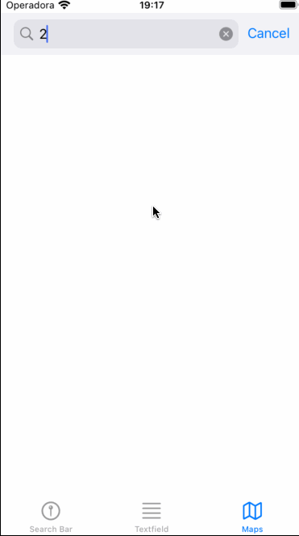

# Google Places SDK for ios

A small project to test the implementation of google places sdk for ios.

The autocomplete is used with 3 options
- Searchbar 
- Fullscreen autocomplete
- Custom tableview result with result pin added to a MapView

## Configuration

Install the necessary podfiles

```
$ cd GooglePlacesDemoSwift
$ pod install
$ open GooglePlacesDemoSwift.xcworkspace
```
In the **Keys.plist** file, add your Google Places Api Key replacing the **_samplekey**

Build the project

### References

https://developers.google.com/maps/documentation/places/ios-sdk/autocomplete

https://www.youtube.com/watch?v=Cd-B5_vkOFs


### Preview

 ‎ ‎ ‎ ‎
 ‎ ‎ ‎ ‎

